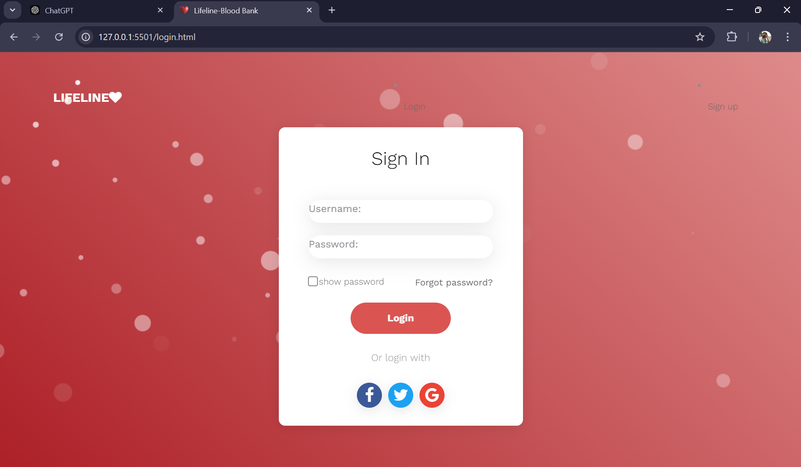

# Lifeline Blood Bank Web Portal

Overview
The **Lifeline Blood Bank Web Portal** is a web-based application that allows users to donate and request blood, providing an essential service to save lives. This project is designed for hospitals, blood banks, and individuals to connect and help those in need.

## Features
- User Registration: Users can create accounts and log in to manage donations and requests.
- **Blood Requests: Users can request blood from a nearby blood bank.
- Blood Donation: Donors can register their details to offer blood.
- Admin Panel: Admins can manage blood donations, requests, and user accounts.
  

## Installation

### Prerequisites
- PHP 7.x or higher
- XAMPP/WAMP (for local development environment)
- Composer (for managing dependencies)

### Steps
1. Clone the repository:
   ```bash
   git clone https://github.com/saidhanush27/Lifeline-Blood-Bank.git

